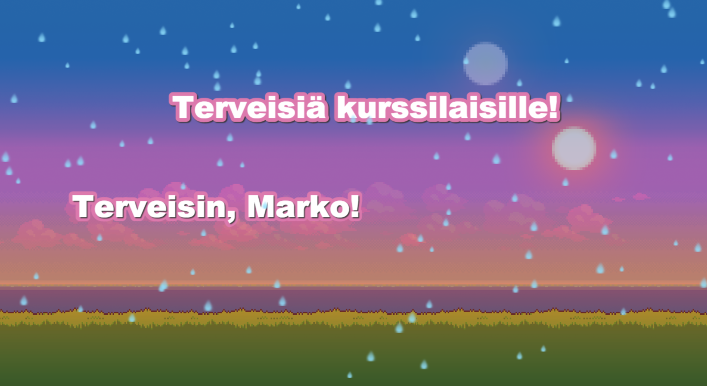

# labra-ohjelmistotekniikka
## Tehtävän anto
Ohjelmistotekniikan työssä tutustutaan web-kehityksen perusteisiin, pienellä kulmakertoimella. Työn
jälkeen olet asentanut koneellesi web-palvelimen, opetellut Phaser-frameworkin käyttöä ja harjoitellut
javascriptillä ohjelman tekemistä.
Phaser on html5 -sovelluskehys jonka fokus on pelinkehityksessä. Mutta, tässä harjoitustyössä tavoitteena
on pelistä poiketen tehdä 'intro'. Intro on yksinkertaisesti selitettynä pienimuotoinen teknisen osaamisen
taidonnäyte. Perinteisesti näissä keskityttiin alunperin yhteen tai kahteen efektiin, ja terveisten sekä
hävyttömyksien huuteluun tutuille. Tästä esimerkkinä Phaserin
http://phaser.io/examples/v2/demoscene/atari-intro . Pian, ja edelleen, näistäkin n tehty useamman
efektin kokoelmia - esim. https://www.youtube.com/watch?v=o6D_MNWfcV8 .
Pyörää kannattaa harvemmin keksiä uudelleen, vaikkakin se on opettavaista. Mutta, meidän
pyörävarastonamme toimivat Phaserin esimerkit: http://phaser.io/examples jossa kannattaa huomata osiot
demoscene ja audio (muista toki saa myös ottaa oppia).

## Toteutus
### index.html
Yksinkertainen html-koodi, joka lataa javascript tiedostot.
### main.js
Phaser-ohjelmistokehystä käyttävä javascript-koodi, joka lataa taustakuvat ja musiikin käytettäväksi (rivit 4-15),
sekä luo aloitus taustakuvan sekä seuraavan taustakuvan alpha arvolla 0 (läpinäkymätön), joka lineaarisesti tuodaan täysin näkyviin
(alpha arvoksi 1) jonka jälkeen se asetetaan taustakuvaksi ja asetetaan seuraava taustakuva joka tuodaan lineaarisesti näkyviin - 
näin saadaan luotua taustakuvista 'daycycle' (rivit 20-28, sekä changeday-funcktio rivit 80-89).

Lisätään kaksi eri tekstiobjektia (text1 ja text2), jossa lukee "Terveisiä kurssilaisille" ja "Terveisin, Marko!" jotka liikkuvat ja
törmäävät toisiinsa (rivit 34-54).

Lisätään myös hieno sade efekti! (rivit 58-73)

## Screenshot

